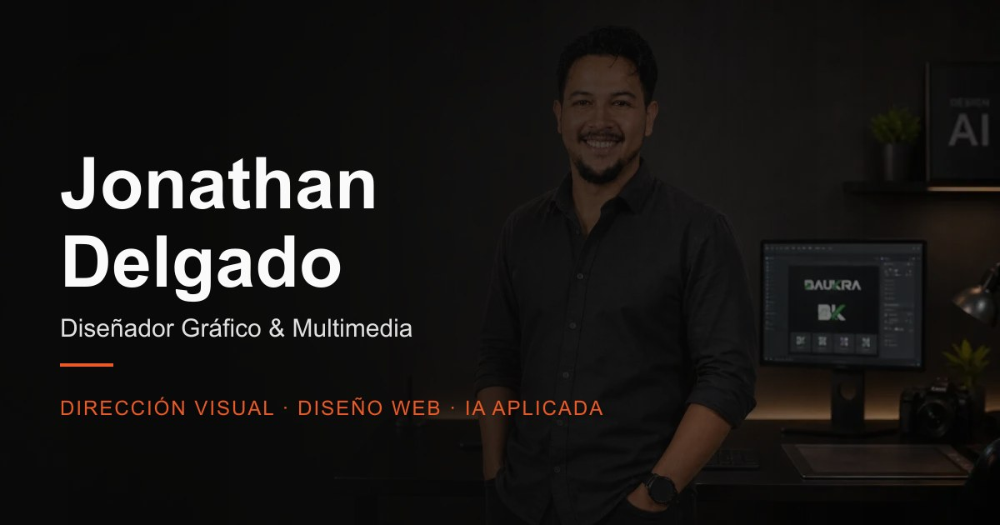

# Portafolio · Jonathan Delgado

Diseñador gráfico y multimedia — branding, dirección visual, experiencias digitales e IA aplicada al proceso creativo. Quito, Ecuador.

**[jdelgado-visual.netlify.app](https://jdelgado-visual.netlify.app)**



Diseño y desarrollo: Jonathan Delgado. Sitio propio, escrito a medida — sin plantilla ni constructor visual.

---

## Qué contiene

Una sola página con diez secciones, nueve proyectos con galería y ficha propia, y un stack de veinticinco herramientas repartidas en cinco áreas.

| | |
|---|---|
| Proyectos | 9, cada uno con modal, galería y vídeo cuando aplica |
| Herramientas | 25 en 5 categorías |
| Imágenes | 220 en WebP |
| JS de producción | 248 kB · **81 kB** con gzip |
| CSS de producción | 77 kB · **14 kB** con gzip |

## Stack

Vanilla JS sobre módulos ES, sin framework. La página es esencialmente contenido y movimiento: un framework habría añadido peso y una capa de abstracción que aquí no paga.

- **[Vite 8](https://vite.dev)** — compilación y servidor de desarrollo
- **[GSAP](https://gsap.com) + ScrollTrigger** — animación y coreografía por scroll
- **[Lenis](https://lenis.darkroom.engineering)** — scroll suave
- **Canvas 2D** — el orbe de herramientas
- **WebGL** — el fondo de la sección de contacto (shader de fragmentos)
- **[sharp](https://sharp.pixelplumbing.com)** — procesado de imágenes en los scripts de build

## Estructura

```
src/
├── sections/     Cada sección de la página, una por fichero
├── components/   Piezas reutilizables (menú, orbe, logo)
├── animations/   Coreografías con GSAP y el carrusel coverflow
├── data/         Contenido: proyectos, herramientas, experiencia, formación
├── styles/       CSS por capas, sin preprocesador
└── utils/        Utilidades transversales
scripts/          Procesado de imágenes, extracción de color, empaquetado
```

El contenido vive en `src/data/`, separado de la presentación: añadir un proyecto o una herramienta es editar un objeto, nunca tocar el marcado.

## Decisiones de diseño

### El orbe gira por ángulo, no por desplazamiento

El círculo de herramientas se controla con el **ángulo del puntero respecto al centro**, no con el desplazamiento horizontal del dedo. Con la X sola, los gestos verticales no hacían nada y el sentido del giro dependía de por qué lado se agarrase el círculo: empujabas hacia abajo y subía. Midiendo el ángulo, el icono que agarras se queda pegado al dedo en cualquier punto del borde.

El giro acumulado no se limita, así que el círculo da vueltas indefinidas en ambos sentidos. Al pulsar un icono se busca la **vuelta equivalente más cercana**, de modo que nunca retrocede más de media vuelta por muchas vueltas que lleves dadas.

### La captura de puntero se pide tarde, a propósito

Capturar el puntero desde el `pointerdown` arregla el arrastre —el navegador deja de mandar eventos cuando el dedo sale del elemento— pero rompe el clic: el `pointerup` se redirige al contenedor y el navegador sitúa el `click` en el ancestro común de ambos, así que nunca llega a la tarjeta. La captura se pide solo cuando el gesto supera el umbral y ya es un arrastre de verdad. El toque simple conserva su clic; el arrastre, su robustez.

### Los bucles de animación se apagan cuando no se ven

El orbe, el shader de contacto y la marquesina de métricas corren en `requestAnimationFrame`. Los tres pasan por un observador de intersección y por `visibilitychange`: fuera de pantalla o en una pestaña de fondo, el bucle se detiene. En un móvil eso es la diferencia entre un sitio fluido y un sitio que calienta el teléfono.

### El canvas se escala por densidad de pantalla

Un canvas tiene dos tamaños: el del elemento y el del búfer, que se multiplica por el `devicePixelRatio`. Si no se aplica la escala en el contexto, el dibujo ocupa solo el cuadrante superior izquierdo. Corregirlo llevó el orbe del 47% al 90% de ocupación de su máscara.

### Los vídeos son fachadas, no reproductores

Los vídeos de YouTube se cargan como imagen estática con botón de reproducción. El `iframe` real solo se inserta al pulsar, y contra `youtube-nocookie.com`. Un `iframe` de YouTube incrustado de salida cuesta cientos de kilobytes y coloca cookies de terceros antes de que nadie haya pedido ver nada.

### El movimiento reducido no apaga la interacción

`prefers-reduced-motion` desactiva animaciones decorativas, no funcionalidad. Las transiciones se acortan y el orbe cede el sitio a una rejilla estática equivalente, pero todo lo que se podía hacer se sigue pudiendo hacer.

## Rendimiento y accesibilidad

- Imágenes en **WebP** con marcadores de posición y carga diferida
- `Cache-Control` inmutable para recursos con hash, vía [`public/_headers`](public/_headers) — viaja dentro del build, así que también aplica en despliegues manuales
- Contraste verificado sobre el fondo real compuesto, no sobre el color nominal
- Navegación por teclado en carrusel, modales y galería; las tarjetas ocultas salen del orden de tabulación y del árbol de accesibilidad
- Indicadores de foco con `:focus-visible`

## Desarrollo

```bash
npm install
npm run dev
```

| Comando | Qué hace |
|---|---|
| `npm run dev` | Servidor de desarrollo |
| `npm run build` | Compila a `dist/` |
| `npm run preview` | Sirve el build ya compilado |
| `node scripts/make-deploy-zip.mjs` | Empaqueta `dist/` para subir a Netlify a mano |

## Despliegue

Netlify, compilando desde `master`. Cada `git push` publica.

El script de empaquetado existe porque `Compress-Archive` de PowerShell escribe las rutas con `\` y Netlify no las reconoce como carpetas: el sitio se despliega plano y todos los recursos dan 404.

---

© 2026 Jonathan Delgado. El código está publicado para acreditar la autoría del sitio. Los proyectos, imágenes, textos y marcas mostrados pertenecen a sus respectivos titulares y no son de uso libre.
